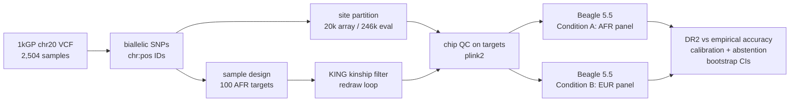

# imputation-calibration-benchmark

**Is Beagle's DR2 a calibrated confidence score, and does its calibration survive an
ancestry-mismatched reference panel?**

Genotyping arrays read ~700k positions; imputation guesses the rest from a reference
panel and attaches a confidence score (DR2) to every guess. Downstream decisions,
including selecting real people for recall-by-genotype studies, lean on those scores.
This benchmark asks whether the scores are honest: when DR2 says 0.9, is the imputed
genotype right about 90% of the time, and does that still hold when the reference panel
does not match the target cohort's ancestry? The mismatch case is not academic: most
reference data is European-biased, and confidence scores that are calibrated for one
ancestry and quietly miscalibrated for another are an equity problem with operational
consequences.

## Design

1000 Genomes Phase 3 provides fully sequenced truth genotypes. Array genotyping is
simulated by masking each target's calls down to a 20,000-site array; the withheld
truth becomes the answer key for grading every imputed genotype.

| | Condition A (control) | Condition B (mismatch) |
|---|---|---|
| Targets | 100 AFR samples | same 100 AFR samples |
| Reference panel | 561 AFR samples | 503 EUR samples |
| Question | favourable-case calibration | does A's calibration transfer? |

The abstention analysis chooses a DR2 threshold on Condition A (retain bins whose
observed-accuracy CI lower bound clears 0.8), then applies that same threshold to
Condition B and reports what actually happens to retained accuracy. Whatever the
result, it ships as found.

## Known limitations (read before the results)

- **Within-cohort circularity.** Condition A's panel and targets come from the same
  cohort: same platform, same joint calling, shared LD structure even after kinship
  filtering. Condition A is a favourable-case control, not an estimate of real-world
  matched-panel performance. **The A-vs-B contrast is the claim; A's absolute numbers
  are not.**
- **Single chromosome.** chr20 is a model system sized for a 32 GB laptop. Per-variant
  confidence calibration is measurable on one chromosome; nothing here is a
  polygenic-score result.
- **Array simulation.** The array is a deterministic uniform thinning of common
  (MAF >= 0.01) biallelic SNPs to 20,000 sites. Array density and common-variant bias
  are mimicked; commercial chip site-selection strategy is not. (HapMap3 intersection
  was the original design; see finding 1 for why it was infeasible here.)
- **Truth definition.** "Truth" is the 1kGP Phase 3 release call set, which has its own
  error rate; concordance with it is the measured quantity.

## Status

| Phase | Scope | Status |
|---|---|---|
| 0 | Verify every external dependency before building | Complete, 4/4 gates ([docs/verification.md](docs/verification.md)) |
| 1 | Sample + site design, array simulation | Complete, gated: exact accounting of all 1,739,315 input sites |
| 2 | Kinship, chip QC, QC report, BGEN evidence | Code complete (39 tests), run in progress |
| 3 | Dual-condition Beagle imputation, Nextflow-wrapped | Pending |
| 4 | Calibration curves, abstention, bootstrap CIs, figures | Pending |

## Findings so far (and what they teach)

**1. The 1kGP v5b chr20 re-release carries no rsIDs.** Every one of 1,739,315
biallelic-SNP records has `.` in the ID column, verified in the raw file. This killed
the planned HapMap3-intersection array design on discovery day and activated the
pre-authorized fallback (chr:pos IDs via `bcftools annotate --set-id`, deterministic
thinning of the common-variant pool). Interpretation: upstream re-releases can change
content, not just filenames, and any ID-dependent design must verify ID presence before
building on it. The widely-copied community filename for this file (v5a) also 404s;
the live server listing is the only primary source.

**2. plink2's BGEN 1.2 export is ref-last, and a wrong import mode complements every
genotype.** A content-signature round trip (VCF to BGEN to VCF, compared by per-site
ALT allele count, which is invariant to phase symbols and heterozygote ordering) failed
with a perfect mirror: every count c became 2N - c. That signature diagnoses an
allele-order flip exactly, and the fix is importing with `ref-last`. The verifier now
recognises the complement pattern and names the fix in its error message; a regression
test guards the format boundary permanently. Interpretation: format conversions need
content-level verification, not just "the command exited 0."

**3. QC accounting as an identity, not a habit.** The QC report parser tolerates plink2
log wording drift (a missing removal line reads as zero), but the report model enforces
`input - removals == kept` before anything is written, so a silently uncounted filter
cannot ship wrong numbers - it raises instead. The same discipline runs through Phase 1:
20,000 array + 246,037 evaluation + 1,473,277 rare-excluded + 1 duplicate = 1,739,315,
every input site classified, nothing dropped silently.

## Engineering notes

- **Test count is the build checksum**: currently 39, all synthetic fixtures, no network
  or real data required; `ruff` + `pytest` gate every commit, CI on push.
- **Every threshold in one place**: `config/settings.py` (Pydantic Settings, `ICB_*`
  env-overridable); the CLI exposes no tuning flags, so runs are reproducible from the
  repo alone.
- **Provenance**: [data/PROVENANCE.md](data/PROVENANCE.md) records every source URL,
  checksum, tool version, and derived-file md5 per run; raw data is gitignored, the
  record is committed.
- **DR2 subtlety for Phase 4**: Beagle declares DR2 as `Number=A` (per-ALT-allele).
  The biallelic-only design collapses it to one value per variant, but the parser will
  index it explicitly rather than assume a scalar.

## Layout

    config/    settings.py - every seed and threshold, env-overridable
    src/       sample_design, sites, qc_report, bgen_roundtrip, cli
    scripts/   phase1.sh (derivation), phase2.sh (kinship -> QC -> report -> BGEN)
    tests/     39 synthetic-fixture tests
    docs/      verification.md - the Phase 0 log, including both findings above
    data/      raw/ and derived/ gitignored; PROVENANCE.md committed
    results/   qc_report.{json,md} and, later, the calibration figures

## Reproduce

    python3 -m venv .venv && source .venv/bin/activate
    pip install -e ".[dev]"
    ruff check . && pytest                  # 39 passing, no data needed
    # place raw inputs per data/PROVENANCE.md, then:
    bash scripts/phase1.sh                  # derivation + exact site accounting
    bash scripts/phase2.sh                  # kinship, chip QC, report, BGEN round trip

Requires: bcftools >= 1.19, plink2 (alpha 7.4 tested), Beagle 5.5, Java >= 1.8.

## References

- Browning BL et al., Beagle 5 imputation (Am J Hum Genet); Beagle 5.5, 27Feb25.75f
- Chang CC et al., plink2 (GigaScience); alpha 7.4
- 1000 Genomes Project Consortium, Phase 3 (Nature 2015); release 20130502, chr20 v5b
- Manichaikul A et al., KING relatedness inference (Bioinformatics 2010)
- HapMap3 SNP list archival copy: Zenodo record 7773502 (retained in provenance;
  unused for v5b data - see finding 1)
